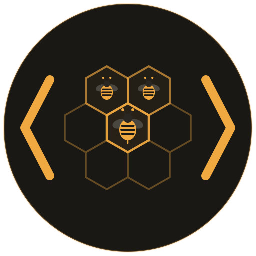

<div align="center">



# fleetode

**One brain, many sessions.**

Manage multiple Claude Code sessions on the same project.<br>
Shared brain, isolated workspaces, real-time dashboard.<br>
No API keys, no auth, no config.

<a href="https://www.npmjs.com/package/fleetode"></a>
<a href="https://opensource.org/licenses/MIT"></a>


<br>

[Why](#why) · [How it works](#how-it-works) · [Dashboard](#dashboard) · [Commands](#commands) · [Coordination](#coordination) · [Requirements](#requirements)

</div>

<br>

```bash
npm i -g fleetode

cd ~/my-project
fleet init          # wraps your project as a hive with bee1
fleet spawn         # creates bee2 (full git clone, shared brain)
fleet spawn         # creates bee3
fleet serve         # opens the dashboard at localhost:3847
```

<br>

## Why

Running parallel Claude Code sessions gets real once you go past one.

- **Brain drift** — each session builds its own understanding in `CLAUDE.md`. Discoveries in one session never reach the others. You end up with three slightly different versions of the truth.
- **Stale branches** — one session pushes to main, the rest keep working on an outdated base. Nobody notices until the merge conflicts hit.
- **Blind coordination** — sessions don't know what each other is doing. Two sessions refactor the same module. One overwrites the other's work.
- **Session setup tax** — every new session means copying the project, restoring trust and permissions, re-establishing context. It adds up.
- **No overview** — costs, progress, what's running, what's idle. You'd have to check each session individually to piece that together.

Fleet gives parallel sessions a shared foundation: one brain, isolated git clones, and a dashboard that shows everything at a glance.

<br>

## How it works

```
my-project/                      ← hive
├── CLAUDE.md                    ← shared brain (single source of truth)
├── .claude/                     ← shared permissions
├── .fleet/                      ← config, journal, coordination rules
│
├── bee1/                        ← your original project (git clone)
│   └── CLAUDE.md → ../CLAUDE.md ← symlink
├── bee2/                        ← spawned clone (own branch)
│   └── CLAUDE.md → ../CLAUDE.md ← symlink
└── bee3/
    └── ...
```

Every bee symlinks back to the shared brain, permissions, and fleet config. When one bee learns something and updates `CLAUDE.md`, every other bee sees it immediately.

| Hive type | Detected by | Each bee is |
|---|---|---|
| **Repo hive** | project has `.git/` | a full `git clone --local` — hardlinked objects, independent branches and remotes |
| **Brain hive** | no git | a lightweight symlink directory |

<br>

## Dashboard

```bash
fleet serve
```

Your hives, bees, and standalone Claude workspaces — all in one view.

<div align="center">
  
</div>

Select a hive to see its bees, their current tasks, session costs, and the shared brain.

<div align="center">
  
</div>

Every bee keeps a permanent timeline — task claims, commits, sync alerts, milestones.

<div align="center">
  
</div>

PRs and commits attributed to each bee. File activity ranked by touches with read/write breakdown.

<div align="center">
  <table>
    <tr>
      <td width="50%"></td>
      <td width="50%"></td>
    </tr>
    <tr>
      <td align="center"><sub><b>Git &amp; PRs</b></sub></td>
      <td align="center"><sub><b>File activity</b></sub></td>
    </tr>
  </table>
</div>

The journal logs significant completions across all bees. Profile gives an AI-generated overview of the hive.

<div align="center">
  <table>
    <tr>
      <td width="50%"></td>
      <td width="50%"></td>
    </tr>
    <tr>
      <td align="center"><sub><b>Journal</b></sub></td>
      <td align="center"><sub><b>Profile</b></sub></td>
    </tr>
  </table>
</div>

<br>

## Commands

**Setup**

```bash
fleet init                    # Wrap current dir as hive + bee1
fleet spawn                   # Create a new bee
fleet adopt <path>            # Import an external dir as a bee
```

**Day-to-day**

```bash
fleet status                  # Show all bees and their state
fleet launch <bee>            # Open a terminal tab in a bee
fleet destroy <bee>           # Remove a bee
```

**Shared knowledge**

```bash
fleet brain                   # Edit the shared CLAUDE.md
fleet journal                 # View the work log
fleet artifact <file>         # Share a file across all bees (dedup + merge)
```

**Health**

```bash
fleet doctor                  # Check for broken symlinks, drift
fleet scan                    # Discover hives and stray bees
fleet clean                   # Remove stale registrations
```

**History**

```bash
fleet event milestone "msg"   # Record to bee's permanent timeline
fleet event decision "msg"    # Log a decision
fleet event discovery "msg"   # Log a finding
```

> [!TIP]
> Run `fleet` with no args for an interactive menu.

<br>

## Coordination

When you `fleet init`, a coordination protocol is injected into `CLAUDE.md`. Each Claude session is told to:

1. **Claim** — write what it's working on to `.fleet/active/<bee>.md`
2. **Check** — read other bees' claims before starting work
3. **Update** — keep the brain current when discovering something new
4. **Log** — append to `.fleet/journal.md` on meaningful completions

The dashboard reads these files to show real-time status. No server process needed for coordination — it's just files.

<br>

## Smart artifacts

`fleet artifact <file>` does more than copy a file to a shared folder:

1. Scans all bees for the same filename
2. If identical everywhere — deduplicates, keeps one copy
3. If different across bees — backs up each version, merges them with Claude, puts the result in `artifacts/`
4. Deletes originals from all bees, symlinks `artifacts/` to every bee

<br>

## Stray detection

```bash
fleet config scan-path ~/repos
fleet scan
```

Fleet discovers standalone Claude workspaces across your machine.

- **Active** — a Claude CLI process is running
- **Asleep** — session history exists but nothing's running

You can adopt strays into a hive or leave them standalone.

<br>

## How it differs

Fleet is not an agent framework. It doesn't run agents, define personas, require API keys, or need a database.

| | **fleetode** | orchestration tools |
|---|---|---|
| **What it does** | Manages your existing Claude Code sessions | Runs its own agents |
| **Setup** | `npm i -g` and go | API keys, config, database |
| **Dependencies** | Zero (bash + node) | Express, SQLite, JWT, etc. |
| **Dashboard** | Real session data (costs, commits, tools) | Task queues and agent status |
| **Architecture** | Files and symlinks | Client-server with auth |

<br>

## Requirements

| | Version | Install |
|---|---|---|
| **Node.js** | 18+ | [nodejs.org](https://nodejs.org) |
| **jq** | any | `brew install jq` · `apt install jq` |
| **claude** | any | [Claude Code](https://claude.com/claude-code) |

<br>

## Development

```bash
git clone https://github.com/Osama-Yusuf/fleet.git
cd fleet
npm link              # makes `fleet` available globally from this repo
npm test              # run tests
```

> [!NOTE]
> Changes to `bin/fleet`, `lib/server.js`, `lib/dashboard.html`, or `lib/bee-life.js` take effect immediately — no build step.

<br>

<div align="center">

**MIT** © [Osama Yusuf](https://github.com/Osama-Yusuf)

<sub>If fleetode saves you a merge conflict, consider starring the repo ⭐</sub>

</div>
