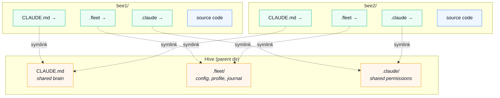
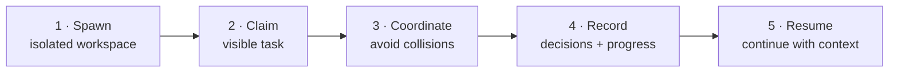
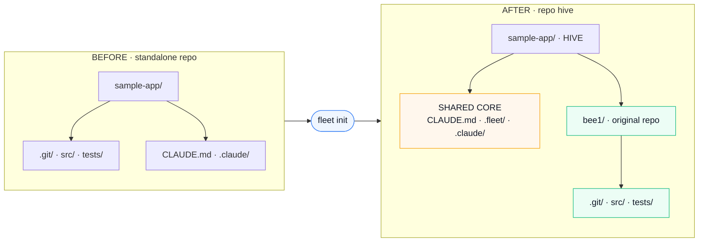
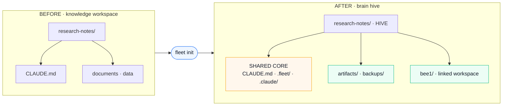
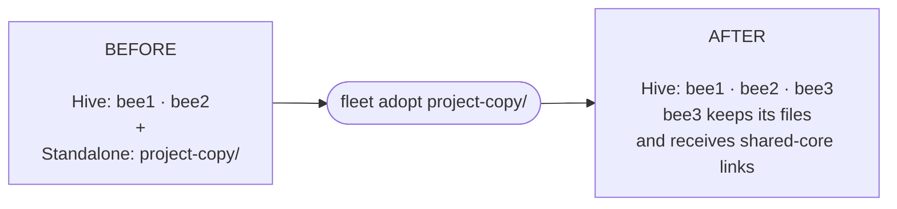

# fleet

Multi-session Claude Code CLI manager — one brain, many sessions.

## The Problem

When you run multiple Claude Code CLI sessions on the same project, a few practical problems show up:

- **Session death on restart** — Mac reboots, only one session survives. The workaround: duplicate the project dir so each session has its own resumable home.
- **Slow session setup** — Bootstrapping another Claude session means copying the project, restoring trust and permissions, finding the right context, and remembering how to resume it.
- **Brain fragmentation** — Each duplicate gets its own CLAUDE.md. Knowledge drifts. One session discovers something, the others never know.
- **No coordination** — Sessions don't know what the others are working on. They collide, duplicate effort, or overwrite each other.
- **Stray projects** — Standalone Claude workspaces accumulate across your repos with no clear view of which ones belong together.

Fleet gives those sessions a lightweight home: one shared brain (`CLAUDE.md`), reproducible worker sessions (bees), and one parent directory (the hive). Spawning a bee bootstraps a trusted, resumable Claude workspace in one command; scanning also surfaces standalone “stray bees” before you decide whether to turn one into a hive or adopt it into an existing one.

## Install

```bash
npm i -g claude-fleet
```

**Requirements:** `jq` (`brew install jq`), `claude` CLI.

## Two Modes

| | Brain Hive | Repo Hive |
|---|---|---|
| **For** | Knowledge-base projects (no code) | Git repos with code |
| **Bees are** | Symlink directories | Full git clones (own branch) |
| **Example** | Research notes | sample application |
| **Detection** | No `.git/` found | `.git/` exists |

Auto-detected by `fleet init`.

## Quick Start

```bash
cd ~/my-project
fleet init

# Creates:
#   my-project/         ← hive (brain, config)
#     bee1/             ← your original project
#     .fleet/           ← fleet config + profile
#     CLAUDE.md         ← shared brain

cd bee1 && claude      # start working
```

## How It Works



Every bee points to the entire shared core—not only the brain. Tasks, history, permissions, and `CLAUDE.md` stay consistent across sessions.

## A Bee's Lifecycle



## Init — Repo Hive

The original dir keeps its name. Code moves into `bee1/`.



`fleet init` creates `bee1`. Run `fleet spawn` afterward to create `bee2`, `bee3`, and beyond.

## Init — Brain Hive

CLAUDE.md stays at hive level. Bees are just symlink dirs.



## Adopt

Pull an existing directory into the hive as the next auto-incremented bee.

```bash
fleet adopt ../sample-app-copy
# → Adopted as bee3/ (branch: master)

fleet adopt ../research-notes-copy
# → Merged CLAUDE.md, moved PDFs to artifacts/, adopted as bee3/
```

Adopt moves the dir into the hive, merges brain content and `.claude/settings`, wires symlinks, and removes the old path.



## Commands

### Core

```bash
fleet init [--name X] [--no-ai]       # Wrap dir as hive + bee1, auto-adopt siblings
fleet spawn [-n N] [--branch B]       # Create new bee(s)
fleet adopt <path>                    # Import external dir as next bee
```

### Manage

```bash
fleet status                          # Show all bees and state
fleet launch <bee> [--resume]         # Open terminal tab in bee
fleet destroy <bee>                   # Remove a bee
```

### Smart

```bash
fleet doctor                          # Health check (broken symlinks, drift)
fleet eject <bee>                     # Move bee back to standalone dir
fleet refresh                         # Re-generate AI profile
fleet clean                           # Remove stale active registrations
fleet journal                         # View work log
fleet brain                           # Edit CLAUDE.md
fleet scan                            # Discover hives and standalone stray bees
fleet event <type> "<message>"        # Add to the current bee's permanent timeline
```

### Interactive

```bash
fleet                                 # No args = interactive menu
```

## Bee Life

Every bee has a permanent append-only history at `.fleet/bees/<bee>/events.jsonl`. Fleet automatically records task claims, task changes, releases, and structured journal entries. Git commits and Claude activity are derived at view time rather than duplicated into the log.

Click a bee in the dashboard to open its life page:

- **Timeline** — claims, milestones, completions, journal entries, decisions, discoveries, and commits
- **Git & PRs** — commits and locally discoverable pull-request references
- **Files** — committed and currently modified files ranked by touches
- **Decisions** — durable decisions and discoveries
- **Tools** — Claude tool usage attributed to that bee
- **Sessions** — account, activity window, message count, and tools per Claude session

Record meaningful events from inside a bee:

```bash
fleet event milestone "Finished the API and started UI integration"
fleet event decision "Use append-only JSONL so history is auditable"
fleet event discovery "Local configuration overrides the shared default"
fleet event blocker "Waiting for credentials to verify deployment"
fleet event test "npm test — 21 passed"
fleet event complete "Shipped the bee life page"
```

Fleet intentionally avoids logging every prompt or raw response by default.

## Find Stray Bees

Configure one or more parent directories, then scan them:

```bash
fleet config scan-path ~/repos
fleet scan
```

Fleet registers hives it finds and separately reports standalone project directories that contain Git, `CLAUDE.md`, `.claude`, or known Claude sessions. It also maps running Claude CLI processes to their working directories: **Active** means the CLI is open, whether busy or waiting for input; **Asleep** means resumable session history exists but no CLI process is running. Nothing is moved or converted until you explicitly initialize or adopt it.

## Coordination Protocol

`fleet init` injects a "Session Coordination" section into CLAUDE.md that tells each Claude session to:

1. **Register** — write `.fleet/active/<bee>.md` with current task
2. **Check** — read other bees' active files before starting work
3. **Update** — keep the brain current when discovering new info
4. **Log** — append to `.fleet/journal.md` on significant completion

## Design Decisions

### Why full clones instead of Git worktrees?

Experienced Git users will immediately ask: "Why not `git worktree add` instead of cloning N times?" Fleet deliberately uses full clones for several reasons:

1. **Same branch on multiple bees.** Git worktrees forbid checking out the same branch in two worktrees simultaneously. Fleet regularly runs multiple bees on `main` — one reviewing, one fixing, one exploring.

2. **Independent remotes.** A worktree shares `.git` with the main tree. You can't point bee1 at `origin` and bee2 at a fork. Clones give each bee its own remote configuration.

3. **Clean lifecycle.** Destroying a bee is `rm -rf`. With worktrees you need `git worktree remove`, and if the main worktree is destroyed, all linked worktrees break.

4. **Claude session identity.** Claude Code keys its project directory on the absolute path. Each bee needs a distinct path with its own session history — worktrees satisfy this, but clones do it without the coupling.

To mitigate the disk cost, Fleet uses `git clone --shared` for repo-hive spawns, which hardlinks `.git/objects` from the source instead of copying them. This gives each bee an independent working tree and ref namespace while sharing the bulk of Git's object storage.

### Why copies instead of symlinks for Claude project dirs?

Each bee gets a **copy** of the Claude project directory (`~/.claude/projects/...`), not a symlink. Symlinks caused session state from one bee to leak into another — Claude would resume a different bee's conversation. Copies ensure full session isolation while preserving the session history from the source bee at the time of creation.

## License

MIT
