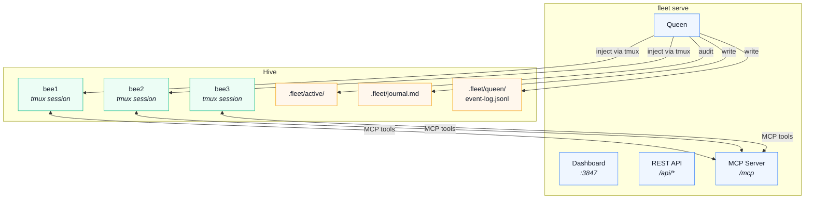
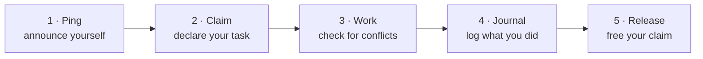
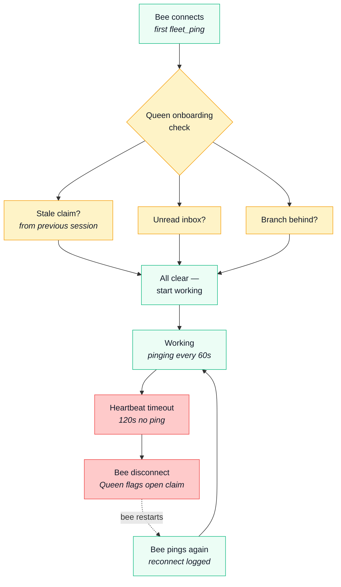
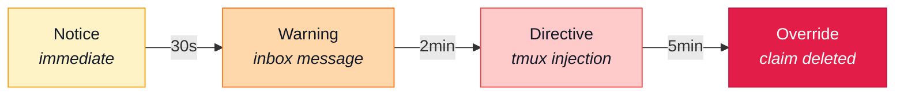

<div align="center">


# fleetode

**One brain, many sessions, one queen.**

Manage multiple Claude Code sessions on the same project.<br>
Shared brain, isolated workspaces, real-time dashboard, autonomous supervisor.<br>
No API keys, no auth, no config.

<a href="https://www.npmjs.com/package/fleetode"></a>
<a href="https://opensource.org/licenses/MIT"></a>


<br>

[Why](#why) · [How it works](#how-it-works) · [Dashboard](#dashboard) · [Queen](#the-queen) · [Commands](#commands) · [Coordination](#coordination) · [Requirements](#requirements)

</div>

<br>

```bash
npm i -g fleetode

cd ~/my-project
fleet init          # wraps your project as a hive with bee1
fleet spawn         # creates bee2 (full git clone, shared brain)
fleet spawn         # creates bee3
fleet serve         # opens the dashboard + starts the Queen
```

<br>

## Why

Running parallel Claude Code sessions gets real once you go past one.

- **Brain drift** - each session builds its own understanding in `CLAUDE.md`. Discoveries in one session never reach the others. You end up with three slightly different versions of the truth.
- **Stale branches** - one session pushes to main, the rest keep working on an outdated base. Nobody notices until the merge conflicts hit.
- **Blind coordination** - sessions don't know what each other is doing. Two sessions refactor the same module. One overwrites the other's work.
- **Session setup tax** - every new session means copying the project, restoring trust and permissions, re-establishing context. It adds up.
- **No overview** - costs, progress, what's running, what's idle. You'd have to check each session individually to piece that together.
- **No oversight** - nobody detects when a session goes idle, forgets to release a task, or edits the same files as another session.

Fleet gives parallel sessions a shared foundation: one brain, isolated git clones, a dashboard that shows everything at a glance, and a Queen supervisor that keeps everything running.

<br>

## How it works

```
my-project/                      ← hive
├── CLAUDE.md                    ← shared brain (single source of truth)
├── .claude/                     ← shared permissions
├── .fleet/                      ← config, journal, coordination rules
│
├── bee1/                        ← your original project (git clone)
│   └── CLAUDE.md → ../CLAUDE.md ← symlink
├── bee2/                        ← spawned clone (own branch)
│   └── CLAUDE.md → ../CLAUDE.md ← symlink
└── bee3/
    └── ...
```

Every bee symlinks back to the shared brain, permissions, and fleet config. When one bee learns something and updates `CLAUDE.md`, every other bee sees it immediately.

| Hive type | Detected by | Each bee is |
|---|---|---|
| **Repo hive** | project has `.git/` | a full `git clone --local` - hardlinked objects, independent branches and remotes |
| **Brain hive** | no git | a lightweight symlink directory |

<br>

## Dashboard

```bash
fleet serve
```

Your hives, bees, and standalone Claude workspaces - all in one view.

<div align="center">
  
</div>

Select a hive to see its bees, their current tasks, session costs, and the shared brain.

<div align="center">
  
</div>

Every bee keeps a permanent timeline - task claims, commits, sync alerts, milestones.

<div align="center">
  
</div>

PRs and commits attributed to each bee. File activity ranked by touches with read/write breakdown.

<div align="center">
  <table>
    <tr>
      <td width="50%"></td>
      <td width="50%"></td>
    </tr>
    <tr>
      <td align="center"><sub><b>Git &amp; PRs</b></sub></td>
      <td align="center"><sub><b>File activity</b></sub></td>
    </tr>
  </table>
</div>

The journal logs significant completions across all bees. Profile gives an AI-generated overview of the hive.

<div align="center">
  <table>
    <tr>
      <td width="50%"></td>
      <td width="50%"></td>
    </tr>
    <tr>
      <td align="center"><sub><b>Journal</b></sub></td>
      <td align="center"><sub><b>Profile</b></sub></td>
    </tr>
  </table>
</div>

<br>

## The Queen

The Queen is a supervisor that runs inside `fleet serve`. It monitors all registered hives, detects problems, and takes action — no human babysitting required.



### What the Queen Does

- **Onboards new bees** — first `fleet_ping` triggers checks: stale claim from a previous session? unread inbox? branch behind upstream? Issues are returned in the ping response so the bee can act immediately
- **Detects bee death** — when a known bee stops pinging (heartbeat stale >120s), the Queen logs a disconnect event and flags the open claim. When it pings again, a reconnect is logged
- **Audits claims every 15s** — detects idle, done, or stale claim files that bees forgot to release
- **Detects file conflicts** — warns when two bees are editing the same files via `git diff` overlap detection
- **Graduates escalation** — notice → warning → directive → override, giving bees a chance to self-correct before the Queen acts
- **Injects via tmux** — sends instructions directly into a bee's Claude session when it runs in tmux
- **Cleans up directly** — at override level, the Queen deletes stale claim files and journals the cleanup
- **Syncs git every 5min** — fetches origin, checks each bee's divergence. Clean tree? Auto-rebase. Dirty tree? Notifies the bee via inbox + tmux
- **Broadcasts via tmux + inbox** — announcements reach active bees immediately via tmux, and are stored in inbox for offline bees
- **Restructures the brain** — detects oversized CLAUDE.md sections (>50 lines) and extracts them to `docs/` with a pointer left behind
- **Spawns review drones** — when a bee requests review, the Queen spawns a `claude --print` session to analyze the work
- **Prunes old drones** — completed drone records are cleaned up after 1 hour

### Bee Lifecycle



#### Birth and Death



### Escalation Chain



Timers are configurable per hive via `.fleet/queen/config.json`.

### MCP Tools

Bees coordinate entirely through MCP tools — no direct file manipulation needed.

| Tool | Purpose |
|------|---------|
| `fleet_ping()` | Heartbeat (call every 60s). Returns status, pending messages, and what other bees are doing |
| `fleet_claim(task)` | Claim a task. Queen checks for conflicts and file overlaps with other bees |
| `fleet_release()` | Release your claim. Never write "idle" or "done" — always use this tool |
| `fleet_journal(entry)` | Log completed work to the shared journal |
| `fleet_check_inbox()` | Read pending messages from Queen or other bees |
| `fleet_lock(resource)` | Exclusive lease on a shared resource (CLAUDE.md, configs) |
| `fleet_unlock(resource)` | Release a lock |
| `fleet_announce(message)` | Broadcast to all bees in your hive |
| `fleet_request_review(summary)` | Ask the Queen to review your work |

### Running Bees in tmux

For full Queen integration (tmux injection, escalation directives), run each bee in a tmux session:

```bash
tmux new-session -s bee1 -c ~/my-project/bee1
claude

# In another terminal tab:
tmux new-session -s bee2 -c ~/my-project/bee2
claude
```

The Queen discovers panes by matching `pane_current_path` — session names can be anything.

<br>

## Commands

**Setup**

```bash
fleet init                    # Wrap current dir as hive + bee1
fleet spawn                   # Create a new bee
fleet adopt <path>            # Import an external dir as a bee
```

**Day-to-day**

```bash
fleet status                  # Show all bees and their state
fleet launch <bee>            # Open a terminal tab in a bee
fleet destroy <bee>           # Remove a bee
```

**Shared knowledge**

```bash
fleet brain                   # Edit the shared CLAUDE.md
fleet journal                 # View the work log
fleet artifact <file>         # Share a file across all bees (dedup + merge)
```

**Queen**

```bash
fleet serve                   # Start dashboard + Queen supervisor
fleet queen                   # Show Queen status
fleet announce "<message>"    # Royal decree — broadcast to all bees
```

**Health**

```bash
fleet doctor                  # Check for broken symlinks, drift
fleet scan                    # Discover hives and stray bees
fleet clean                   # Remove stale registrations
```

**History**

```bash
fleet event milestone "msg"   # Record to bee's permanent timeline
fleet event decision "msg"    # Log a decision
fleet event discovery "msg"   # Log a finding
```

> [!TIP]
> Run `fleet` with no args for an interactive menu.

<br>

## Coordination

When you `fleet init`, a coordination protocol is injected into `CLAUDE.md`. Each Claude session is told to:

1. **Ping** — call `fleet_ping()` on start and every 60s for heartbeat + situational awareness
2. **Claim** — declare what you're working on via `fleet_claim(task)`, get conflict warnings
3. **Check** — read the response for file overlaps with other bees before starting work
4. **Work** — do the task
5. **Journal** — log completed work via `fleet_journal(entry)`
6. **Release** — free your claim via `fleet_release()` when done
7. **Review** — optionally request Queen review via `fleet_request_review(summary)`

The Queen validates every claim, detects file overlaps between bees, and escalates through notice → warning → directive → override when bees don't follow the protocol. At override level, the Queen deletes stale claims directly — no human intervention needed.

<br>

## Smart artifacts

`fleet artifact <file>` does more than copy a file to a shared folder:

1. Scans all bees for the same filename
2. If identical everywhere - deduplicates, keeps one copy
3. If different across bees - backs up each version, merges them with Claude, puts the result in `artifacts/`
4. Deletes originals from all bees, symlinks `artifacts/` to every bee

<br>

## Stray detection

```bash
fleet config scan-path ~/repos
fleet scan
```

Fleet discovers standalone Claude workspaces across your machine.

- **Active** - a Claude CLI process is running
- **Asleep** - session history exists but nothing's running

You can adopt strays into a hive or leave them standalone.

<br>

## How it differs

Fleet is not an agent framework. It doesn't run agents, define personas, require API keys, or need a database.

| | **fleetode** | orchestration tools |
|---|---|---|
| **What it does** | Manages your existing Claude Code sessions | Runs its own agents |
| **Setup** | `npm i -g` and go | API keys, config, database |
| **Dependencies** | Zero (bash + node) | Express, SQLite, JWT, etc. |
| **Dashboard** | Real session data (costs, commits, tools) | Task queues and agent status |
| **Architecture** | Files and symlinks | Client-server with auth |

<br>

## Design decisions

### Why full clones instead of Git worktrees?

Git worktrees forbid checking out the same branch in two worktrees simultaneously. Fleet regularly runs multiple bees on `main`. Clones also give each bee its own remote configuration. When spawning from a local bee, `git clone --local` hardlinks `.git/objects` — minimal disk overhead with full independence.

### Why MCP instead of file-based coordination?

The original design used file-based rules that told bees to manually read/write `.fleet/active/` files. This drifted — bees would write "idle" to claim files instead of deleting them, skip reading rules entirely, or forget to clean up. MCP tools solve this by embedding the rules in tool descriptions (re-read on every call, immune to context compaction) and enforcing behavior at the protocol layer.

<br>

## Requirements

| | Version | Install |
|---|---|---|
| **Node.js** | 18+ | [nodejs.org](https://nodejs.org) |
| **jq** | any | `brew install jq` · `apt install jq` |
| **claude** | any | [Claude Code](https://claude.com/claude-code) |

<br>

## Development

```bash
git clone https://github.com/Osama-Yusuf/fleet.git
cd fleet
npm link              # makes `fleet` available globally from this repo
npm test              # run tests
```

> [!NOTE]
> Changes to `bin/fleet`, `lib/server.js`, `lib/dashboard.html`, or `lib/bee-life.js` take effect immediately - no build step.

<br>

<div align="center">

**MIT** © [Osama Yusuf](https://github.com/Osama-Yusuf)

<sub>If fleetode saves you a merge conflict, consider starring the repo ⭐</sub>

</div>
