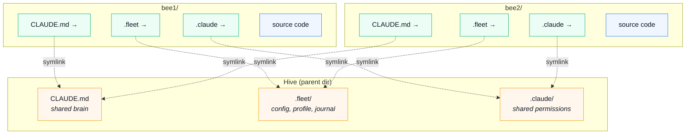
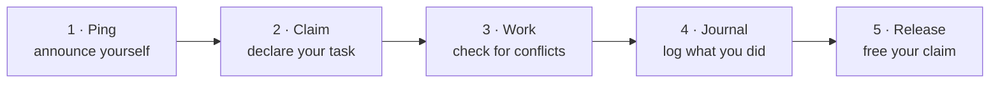
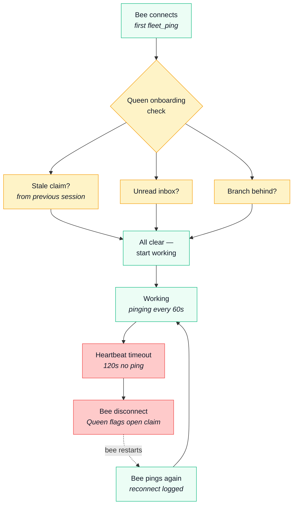
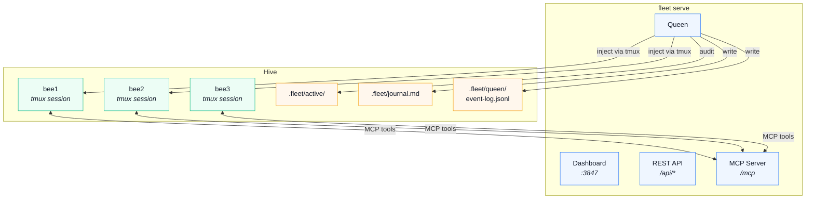
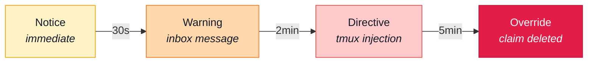
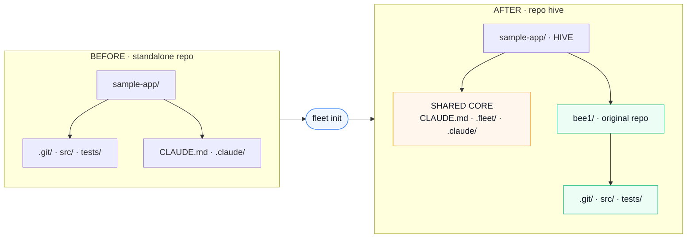
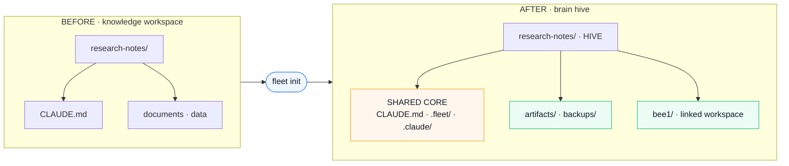
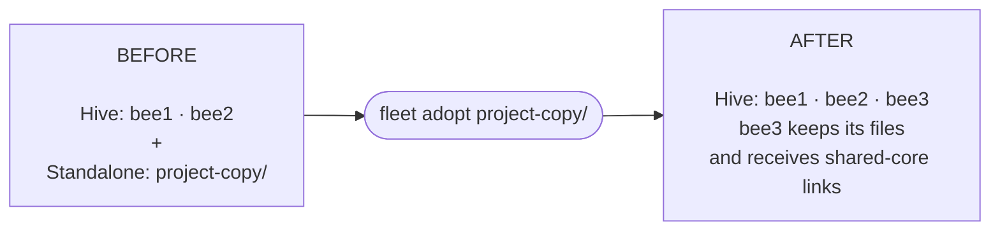

# fleet

Multi-session Claude Code CLI manager — one brain, many workers, one queen.

## The Problem

When you run multiple Claude Code CLI sessions on the same project, a few practical problems show up:

- **Session death on restart** — Mac reboots, only one session survives. The workaround: duplicate the project dir so each session has its own resumable home.
- **Slow session setup** — Bootstrapping another Claude session means copying the project, restoring trust and permissions, finding the right context, and remembering how to resume it.
- **Brain fragmentation** — Each duplicate gets its own CLAUDE.md. Knowledge drifts. One session discovers something, the others never know.
- **No coordination** — Sessions don't know what the others are working on. They collide, duplicate effort, or overwrite each other.
- **No oversight** — Nobody detects when a session goes idle, forgets to release a task, or edits the same files as another session.
- **Stray projects** — Standalone Claude workspaces accumulate across your repos with no clear view of which ones belong together.

Fleet gives those sessions a lightweight home: one shared brain (`CLAUDE.md`), reproducible worker sessions (bees), one parent directory (the hive), and a Queen supervisor that keeps everything running. Spawning a bee bootstraps a trusted, resumable Claude workspace in one command; scanning also surfaces standalone "stray bees" before you decide whether to turn one into a hive or adopt it into an existing one.

## Install

```bash
npm i -g claude-fleet
```

**Requirements:** `jq` (`brew install jq`), `claude` CLI.

## Two Modes

| | Brain Hive | Repo Hive |
|---|---|---|
| **For** | Knowledge-base projects (no code) | Git repos with code |
| **Bees are** | Symlink directories | Full git clones (own branch) |
| **Example** | Research notes | sample application |
| **Detection** | No `.git/` found | `.git/` exists |

Auto-detected by `fleet init`.

## Quick Start

```bash
cd ~/my-project
fleet init

# Creates:
#   my-project/         ← hive (brain, config)
#     bee1/             ← your original project
#     .fleet/           ← fleet config + profile
#     CLAUDE.md         ← shared brain

cd bee1 && claude      # start working
```

## How It Works


```mermaid
graph TB
    subgraph Hive["Hive (parent dir)"]
        BRAIN["CLAUDE.md<br/><i>shared brain</i>"]
        FLEET[".fleet/<br/><i>config, profile, journal</i>"]
        CLAUDE_DIR[".claude/<br/><i>shared permissions</i>"]
    end

    subgraph Bee1["bee1/"]
        B1_BRAIN["CLAUDE.md →"]
        B1_FLEET[".fleet →"]
        B1_CLAUDE[".claude →"]
        B1_CODE["source code"]
    end

    subgraph Bee2["bee2/"]
        B2_BRAIN["CLAUDE.md →"]
        B2_FLEET[".fleet →"]
        B2_CLAUDE[".claude →"]
        B2_CODE["source code"]
    end

    B1_BRAIN -.->|symlink| BRAIN
    B1_FLEET -.->|symlink| FLEET
    B1_CLAUDE -.->|symlink| CLAUDE_DIR
    B2_BRAIN -.->|symlink| BRAIN
    B2_FLEET -.->|symlink| FLEET
    B2_CLAUDE -.->|symlink| CLAUDE_DIR

    classDef shared fill:#fff7ed,stroke:#f59e0b,color:#111827
    classDef beeLink fill:#ecfdf5,stroke:#10b981,color:#111827
    classDef code fill:#eff6ff,stroke:#3b82f6,color:#111827
    class BRAIN,FLEET,CLAUDE_DIR shared
    class B1_BRAIN,B1_FLEET,B1_CLAUDE,B2_BRAIN,B2_FLEET,B2_CLAUDE beeLink
    class B1_CODE,B2_CODE code
```

Every bee points to the entire shared core—not only the brain. Tasks, history, permissions, and `CLAUDE.md` stay consistent across sessions.

## A Bee's Lifecycle


```mermaid
flowchart LR
    A["1 · Ping<br/>announce yourself"] --> B["2 · Claim<br/>declare your task"]
    B --> C["3 · Work<br/>check for conflicts"]
    C --> D["4 · Journal<br/>log what you did"]
    D --> E["5 · Release<br/>free your claim"]
```

### Birth and Death


```mermaid
flowchart TB
    CONNECT["Bee connects<br/><i>first fleet_ping</i>"]
    ONBOARD{"Queen onboarding<br/>check"}
    STALE["Stale claim?<br/><i>from previous session</i>"]
    INBOX["Unread inbox?"]
    BEHIND["Branch behind?"]
    CLEAR["All clear —<br/>start working"]
    WORK["Working<br/><i>pinging every 60s</i>"]
    TIMEOUT["Heartbeat timeout<br/><i>120s no ping</i>"]
    DEAD["Bee disconnect<br/><i>Queen flags open claim</i>"]
    RECONNECT["Bee pings again<br/><i>reconnect logged</i>"]

    CONNECT --> ONBOARD
    ONBOARD --> STALE --> CLEAR
    ONBOARD --> INBOX --> CLEAR
    ONBOARD --> BEHIND --> CLEAR
    CLEAR --> WORK
    WORK --> TIMEOUT --> DEAD
    DEAD -.->|bee restarts| RECONNECT --> WORK

    classDef check fill:#fef3c7,stroke:#f59e0b,color:#111827
    classDef active fill:#ecfdf5,stroke:#10b981,color:#111827
    classDef dead fill:#fecaca,stroke:#ef4444,color:#111827
    class ONBOARD,STALE,INBOX,BEHIND check
    class CONNECT,CLEAR,WORK,RECONNECT active
    class TIMEOUT,DEAD dead
```

## The Queen

The Queen is a supervisor that runs inside `fleet serve`. It monitors all registered hives, detects problems, and takes action — no human babysitting required.


```mermaid
flowchart TB
    subgraph Server["fleet serve"]
        DASH["Dashboard<br/><i>:3847</i>"]
        API["REST API<br/><i>/api/*</i>"]
        MCP["MCP Server<br/><i>/mcp</i>"]
        QUEEN["Queen"]
    end

    subgraph Hive
        B1["bee1<br/><i>tmux session</i>"]
        B2["bee2<br/><i>tmux session</i>"]
        B3["bee3<br/><i>tmux session</i>"]
        ACTIVE[".fleet/active/"]
        JOURNAL[".fleet/journal.md"]
        EVENTS[".fleet/queen/<br/>event-log.jsonl"]
    end

    B1 <-->|MCP tools| MCP
    B2 <-->|MCP tools| MCP
    B3 <-->|MCP tools| MCP
    QUEEN -->|audit| ACTIVE
    QUEEN -->|inject via tmux| B1
    QUEEN -->|inject via tmux| B2
    QUEEN -->|write| JOURNAL
    QUEEN -->|write| EVENTS

    classDef server fill:#eff6ff,stroke:#3b82f6,color:#111827
    classDef bee fill:#ecfdf5,stroke:#10b981,color:#111827
    classDef state fill:#fff7ed,stroke:#f59e0b,color:#111827
    class DASH,API,MCP,QUEEN server
    class B1,B2,B3 bee
    class ACTIVE,JOURNAL,EVENTS state
```

### What the Queen Does

- **Onboards new bees** — first `fleet_ping` triggers checks: stale claim from a previous session? unread inbox? branch behind upstream? Issues are returned in the ping response so the bee can act immediately
- **Detects bee death** — when a known bee stops pinging (heartbeat stale >120s), the Queen logs a disconnect event and flags the open claim. When it pings again, a reconnect is logged
- **Audits claims every 15s** — detects idle, done, or stale claim files that bees forgot to release
- **Detects file conflicts** — warns when two bees are editing the same files via `git diff` overlap detection
- **Graduates escalation** — notice → warning → directive → override, giving bees a chance to self-correct before the Queen acts
- **Injects via tmux** — sends instructions directly into a bee's Claude session when it runs in tmux
- **Cleans up directly** — at override level, the Queen deletes stale claim files and journals the cleanup (no drone needed)
- **Syncs git every 5min** — fetches origin, checks each bee's divergence from the default branch. Clean tree? Auto-rebase. Dirty tree? Notifies the bee via inbox + tmux
- **Broadcasts via tmux + inbox** — announcements reach active bees immediately via tmux, and are stored in inbox for offline bees
- **Restructures the brain** — detects oversized CLAUDE.md sections (>50 lines) and extracts them to `docs/` with a pointer left behind
- **Spawns review drones** — when a bee requests review, the Queen spawns a `claude --print` session to analyze the work
- **Prunes old drones** — completed drone records are cleaned up after 1 hour

### Escalation Chain


```mermaid
flowchart LR
    N["Notice<br/><i>immediate</i>"] -->|30s| W["Warning<br/><i>inbox message</i>"]
    W -->|2min| D["Directive<br/><i>tmux injection</i>"]
    D -->|5min| O["Override<br/><i>claim deleted</i>"]

    classDef notice fill:#fef3c7,stroke:#f59e0b,color:#111827
    classDef warn fill:#fed7aa,stroke:#f97316,color:#111827
    classDef directive fill:#fecaca,stroke:#ef4444,color:#111827
    classDef override fill:#e11d48,stroke:#be123c,color:#fff
    class N notice
    class W warn
    class D directive
    class O override
```

Timers are configurable per hive via `.fleet/queen/config.json`.

### MCP Tools

Bees coordinate entirely through MCP tools — no direct file manipulation needed. The Queen validates every action.

| Tool | Purpose |
|------|---------|
| `fleet_ping()` | Heartbeat (call every 60s). Returns status, pending messages, and what other bees are doing |
| `fleet_claim(task)` | Claim a task. Queen checks for conflicts and file overlaps with other bees |
| `fleet_release()` | Release your claim. Never write "idle" or "done" — always use this tool |
| `fleet_journal(entry)` | Log completed work to the shared journal |
| `fleet_check_inbox()` | Read pending messages from Queen or other bees |
| `fleet_lock(resource)` | Exclusive lease on a shared resource (CLAUDE.md, configs) |
| `fleet_unlock(resource)` | Release a lock |
| `fleet_announce(message)` | Broadcast to all bees in your hive |
| `fleet_request_review(summary)` | Ask the Queen to review your work |

Each bee gets a `.mcp.json` automatically on spawn, connecting it to the fleet server with proper identity headers.

### Running Bees in tmux

For full Queen integration, run each bee in a tmux session:

```bash
tmux new-session -s bee1 -c ~/my-project/bee1
claude

# In another terminal tab:
tmux new-session -s bee2 -c ~/my-project/bee2
claude
```

The Queen discovers panes by matching `pane_current_path` — session names can be anything you want.

## Init — Repo Hive

The original dir keeps its name. Code moves into `bee1/`.


```mermaid
flowchart LR
    subgraph BEFORE["BEFORE · standalone repo"]
        direction TB
        B_ROOT["sample-app/"]
        B_REPO[".git/ · src/ · tests/"]
        B_CORE["CLAUDE.md · .claude/"]
        B_ROOT --> B_REPO
        B_ROOT --> B_CORE
    end

    INIT(["fleet init"])

    subgraph AFTER["AFTER · repo hive"]
        direction TB
        A_ROOT["sample-app/ · HIVE"]
        A_CORE["SHARED CORE<br/>CLAUDE.md · .fleet/ · .claude/"]
        A_BEE["bee1/ · original repo"]
        A_FILES[".git/ · src/ · tests/"]
        A_ROOT --> A_CORE
        A_ROOT --> A_BEE --> A_FILES
    end

    BEFORE --> INIT --> AFTER

    classDef shared fill:#fff7ed,stroke:#f59e0b,color:#111827
    classDef bee fill:#ecfdf5,stroke:#10b981,color:#111827
    classDef action fill:#eff6ff,stroke:#3b82f6,color:#111827
    class A_CORE shared
    class A_BEE,A_FILES bee
    class INIT action
```

`fleet init` creates `bee1`. Run `fleet spawn` afterward to create `bee2`, `bee3`, and beyond.

## Init — Brain Hive

CLAUDE.md stays at hive level. Bees are just symlink dirs.


```mermaid
flowchart LR
    subgraph BEFORE["BEFORE · knowledge workspace"]
        direction TB
        B_ROOT["research-notes/"]
        B_BRAIN["CLAUDE.md"]
        B_DATA["documents · data"]
        B_ROOT --> B_BRAIN
        B_ROOT --> B_DATA
    end

    INIT(["fleet init"])

    subgraph AFTER["AFTER · brain hive"]
        direction TB
        A_ROOT["research-notes/ · HIVE"]
        A_CORE["SHARED CORE<br/>CLAUDE.md · .fleet/ · .claude/"]
        A_DATA["artifacts/ · backups/"]
        A_BEE["bee1/ · linked workspace"]
        A_ROOT --> A_CORE
        A_ROOT --> A_DATA
        A_ROOT --> A_BEE
    end

    BEFORE --> INIT --> AFTER

    classDef shared fill:#fff7ed,stroke:#f59e0b,color:#111827
    classDef bee fill:#ecfdf5,stroke:#10b981,color:#111827
    classDef action fill:#eff6ff,stroke:#3b82f6,color:#111827
    class A_CORE shared
    class A_BEE,A_DATA bee
    class INIT action
```

## Adopt

Pull an existing directory into the hive as the next auto-incremented bee.

```bash
fleet adopt ../sample-app-copy
# → Adopted as bee3/ (branch: master)

fleet adopt ../research-notes-copy
# → Merged CLAUDE.md, moved PDFs to artifacts/, adopted as bee3/
```

Adopt moves the dir into the hive, merges brain content and `.claude/settings`, wires symlinks, and removes the old path.


```mermaid
flowchart LR
    BEFORE["BEFORE<br/><br/>Hive: bee1 · bee2<br/>+<br/>Standalone: project-copy/"]
    ADOPT(["fleet adopt project-copy/"])
    AFTER["AFTER<br/><br/>Hive: bee1 · bee2 · bee3<br/>bee3 keeps its files<br/>and receives shared-core links"]
    BEFORE --> ADOPT --> AFTER
```

## Commands

### Core

```bash
fleet init [--name X] [--no-ai]       # Wrap dir as hive + bee1, auto-adopt siblings
fleet spawn [-n N] [--branch B]       # Create new bee(s)
fleet adopt <path>                    # Import external dir as next bee
```

### Manage

```bash
fleet status                          # Show all bees and state
fleet launch <bee> [--resume]         # Open terminal tab in bee
fleet destroy <bee>                   # Remove a bee
```

### Smart

```bash
fleet doctor                          # Health check (broken symlinks, drift)
fleet eject <bee>                     # Move bee back to standalone dir
fleet refresh                         # Re-generate AI profile
fleet clean                           # Remove stale active registrations
fleet journal                         # View work log
fleet brain                           # Edit CLAUDE.md
fleet scan                            # Discover hives and standalone stray bees
fleet event <type> "<message>"        # Add to the current bee's permanent timeline
```

### Queen

```bash
fleet serve                           # Start dashboard + Queen supervisor
fleet queen                           # Show Queen status
fleet announce "<message>"            # Royal decree — broadcast to all bees
```

### Interactive

```bash
fleet                                 # No args = interactive menu
```

## Dashboard

`fleet serve` starts the dashboard at `http://localhost:3847` (configurable via `FLEET_PORT`).

- **Sidebar** — all registered hives and stray bees, with live status
- **Bee tabs** — timeline, git, files, decisions, tools, sessions per bee
- **Queen tab** — live supervisor state: escalations, drones, brain audit, event log, and a Royal Decree input for broadcasting to all bees
- **Search** — hive-wide full-text search with scroll-to-highlight

## Bee Life

Every bee has a permanent append-only history at `.fleet/bees/<bee>/events.jsonl`. Fleet automatically records task claims, task changes, releases, and structured journal entries. Git commits and Claude activity are derived at view time rather than duplicated into the log.

Click a bee in the dashboard to open its life page:

- **Timeline** — claims, milestones, completions, journal entries, decisions, discoveries, and commits
- **Git & PRs** — commits and locally discoverable pull-request references
- **Files** — committed and currently modified files ranked by touches
- **Decisions** — durable decisions and discoveries
- **Tools** — Claude tool usage attributed to that bee
- **Sessions** — account, activity window, message count, and tools per Claude session

Record meaningful events from inside a bee:

```bash
fleet event milestone "Finished the API and started UI integration"
fleet event decision "Use append-only JSONL so history is auditable"
fleet event discovery "Local configuration overrides the shared default"
fleet event blocker "Waiting for credentials to verify deployment"
fleet event test "npm test — 21 passed"
fleet event complete "Shipped the bee life page"
```

Fleet intentionally avoids logging every prompt or raw response by default.

## Find Stray Bees

Configure one or more parent directories, then scan them:

```bash
fleet config scan-path ~/repos
fleet scan
```

Fleet registers hives it finds and separately reports standalone project directories that contain Git, `CLAUDE.md`, `.claude`, or known Claude sessions. It also maps running Claude CLI processes to their working directories: **Active** means the CLI is open, whether busy or waiting for input; **Asleep** means resumable session history exists but no CLI process is running. Nothing is moved or converted until you explicitly initialize or adopt it.

## Coordination Protocol

`fleet init` injects a coordination section into CLAUDE.md that tells each bee to use MCP tools for all coordination:

```
fleet_ping()    → heartbeat + situational awareness
fleet_claim()   → declare task, get conflict warnings
fleet_journal() → log completed work
fleet_release() → free claim when done
```

The Queen validates every claim, detects file overlaps between bees, and escalates through notice → warning → directive → override when bees don't follow the protocol. At override level, the Queen deletes stale claims directly — no human intervention needed.

## Design Decisions

### Why full clones instead of Git worktrees?

Experienced Git users will immediately ask: "Why not `git worktree add` instead of cloning N times?" Fleet deliberately uses full clones for two reasons:

1. **Same branch on multiple bees.** Git worktrees forbid checking out the same branch in two worktrees simultaneously. Fleet regularly runs multiple bees on `main` — one reviewing, one fixing, one exploring.

2. **Independent remotes.** A worktree shares `.git` with the main tree. You can't point bee1 at `origin` and bee2 at a fork. Clones give each bee its own remote configuration.

When spawning from a local bee (the common case), `git clone` defaults to `--local`, which hardlinks `.git/objects` from the source rather than copying them. Git objects are immutable and gc writes new packfiles rather than mutating existing ones, so hardlinks stay safe — deleting or garbage-collecting any bee never affects its siblings. Each bee gets a fully independent working tree and ref namespace with minimal disk overhead.

Fleet deliberately avoids `--shared` (alternates) because it creates a dependency chain: if the source repo is deleted or gc'd, every clone pointing at it via alternates becomes corrupted. Hardlinks provide the same disk savings without the coupling.

### Why copies instead of symlinks for Claude project dirs?

Each bee gets a **copy** of the Claude project directory (`~/.claude/projects/...`), not a symlink. Symlinks caused session state from one bee to leak into another — Claude would resume a different bee's conversation. Copies ensure full session isolation while preserving the session history from the source bee at the time of creation.

### Why MCP instead of file-based coordination?

The original design used file-based rules (RULES.md) that told bees to manually read/write `.fleet/active/` files. This drifted — bees would write "idle" to claim files instead of deleting them, skip reading RULES.md entirely, or forget to clean up. MCP tools solve this by embedding the rules in the tool descriptions (re-read on every call, immune to context compaction) and enforcing behavior at the protocol layer (the Queen validates on every `fleet_claim`, not relying on bees to self-police).

## License

MIT
